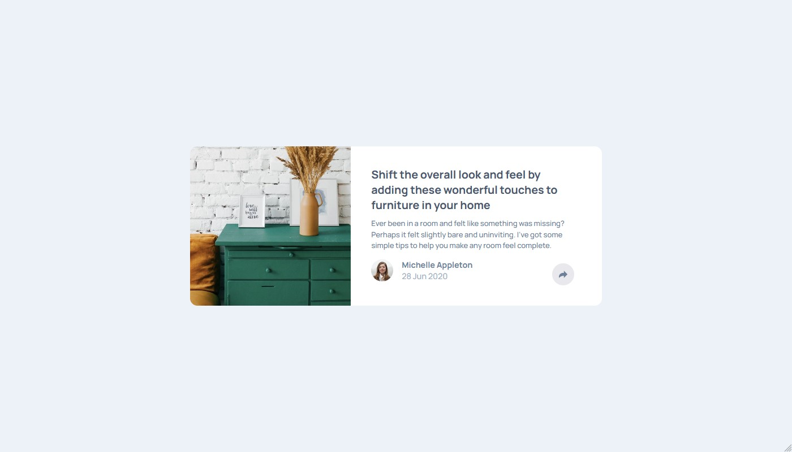
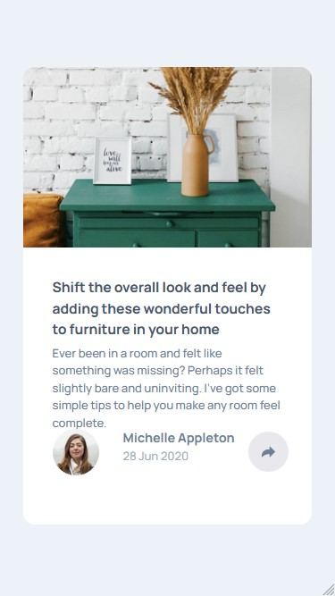

# Frontend Mentor - Article preview component solution

This is a solution to the [Article preview component challenge on Frontend Mentor](https://www.frontendmentor.io/challenges/article-preview-component-dYBN_pYFT). Frontend Mentor challenges help you improve your coding skills by building realistic projects.

## Table of contents

- [The challenge](#the-challenge)
- [Screenshot](#screenshot)
- [Links](#links)
- [Author](#author)

### The challenge

Users should be able to:

- View the optimal layout for the component depending on their device's screen size
- See the social media share links when they click the share icon

### Screenshot

### Links

- Live Site URL: [Article preview component](https://sparkling-strudel-961baa.netlify.app/)

### Built with

- Semantic HTML5 markup
- CSS custom properties
- Flexbox
- JavaScript
- Mobile-first workflow

## Author

- Frontend Mentor - [@Campiottocodes](https://www.frontendmentor.io/profile/Campiottocodes)
- LinkedIn - [Vinicius Campiotto](https://www.linkedin.com/in/vinicius-campiotto-421233250/)
